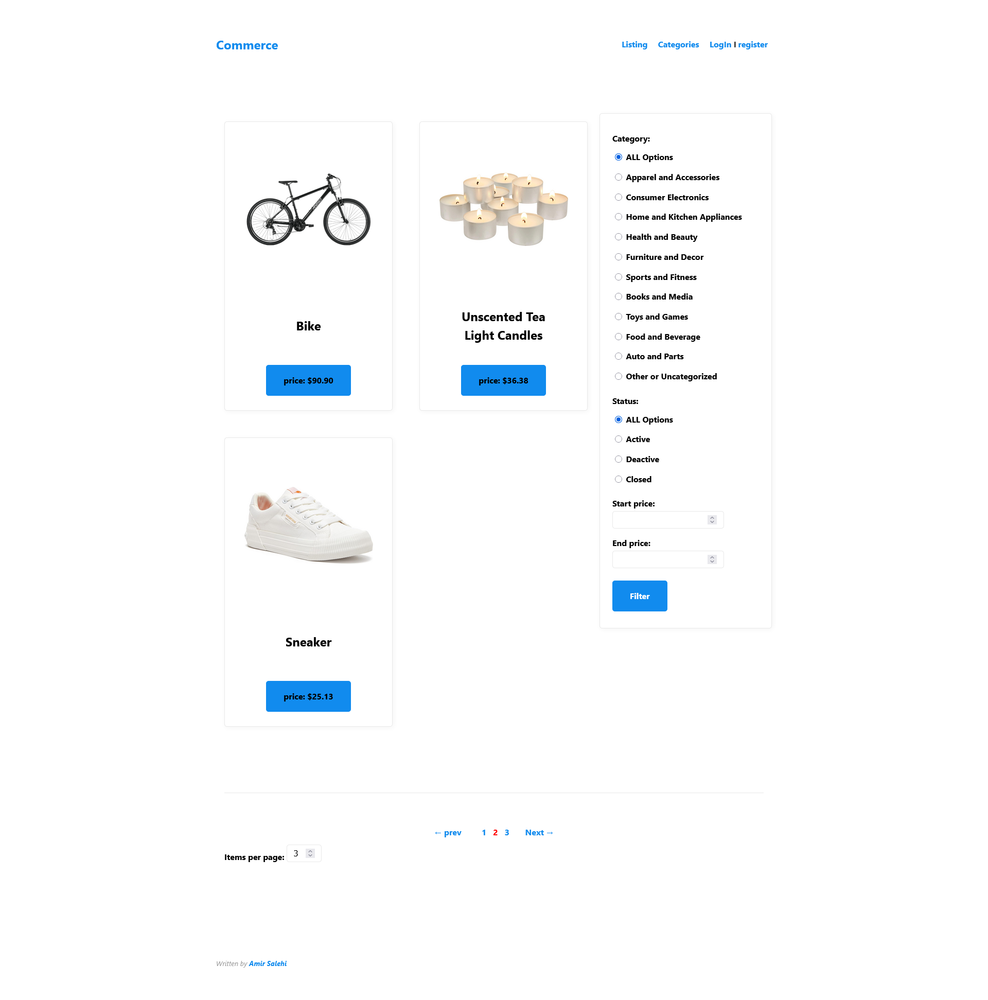
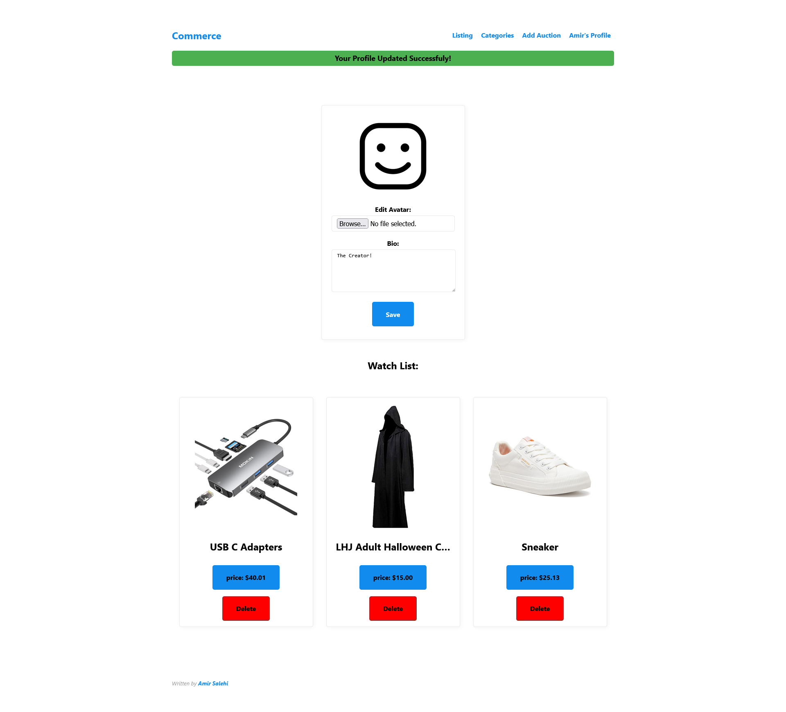

# Commerce Development

A site created for auctions based on [CS50 WEB, Project 2 (Commerce)](https://cs50.harvard.edu/web/2020/projects/2/commerce/). This website is written from scratch and not from distribution code.


*Figure 1: A screenshot of the Commerce index page.*


*Figure 2: A screenshot of the Commerce auctions listing page.*


*Figure 3: A screenshot of the Commerce user profile page.*

## Project

An eBay-like e-commerce auction site that allows users to post auction listings, place bids on listings, comment on those listings, and add listings to a “watchlist.”  
This version includes all those features plus:
- **Auction Manager View:** Users can add and edit auctions seamlessly.
- **Enhanced Listing View:** Features filtering based on categories, status, and price, as well as pagination.
- **Customized User Accounts:** Utilizes Django’s default implementation for user accounts, with a custom UserProfile model to store user-specific data and a customized registration view and form.
- **User Profiles:** Each user has an avatar and bio, with editing capabilities through a dedicated UserProfile view.
- **Image Uploads:** Auctions and profiles support image uploads.
- **Styling:** Primarily handled using MVP.CSS, with custom CSS applied where necessary.
- **Management Command for Cleanup:** Includes a management command (`cleanup`) that removes unused uploaded images, helping to keep the media storage clean. The command supports a `--yes` or `-y` flag, allowing it to run non-interactively for use in automated scripts.

## Automated Tests

Automated tests are provided for:
- register view
- UserProfile view
- The cleanup management command

Run all tests with:
```sh
python manage.py test
```

## Setup

To set up the project locally, follow these steps:

1. **Clone the Repository:**
   ```sh
   git clone https://github.com/Luminous2-hash/Commerce-Development.git
   cd Commerce-Development
   ```

2. **Install Dependencies:**
   ```sh
   pip install -r requirements.txt
   ```

3. **Create Required Directories for Media Uploads:**
   ```sh
   mkdir -p media/commerce/uploads/auction_images
   mkdir -p media/commerce/uploads/profile_images
   ```

4. **Run Migrations:**
   ```sh
   python manage.py migrate
   ```

5. **Create a Superuser:**
   ```sh
   python manage.py createsuperuser
   ```

6. **Run the Development Server:**
   ```sh
   python manage.py runserver
   ```

7. **Access the Application:**
   Open your browser and go to `http://127.0.0.1:8000/`.

## Contributing

Contributions are welcome! Please open an issue or submit a pull request.

## License

This project is licensed under the MIT License. See the [LICENSE](LICENSE) file for details.